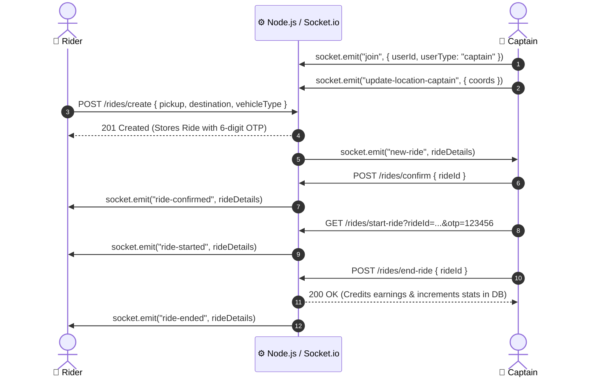

# 🚖 Uber Clone — Full-Stack Real-Time Ride Hailing Platform

A full-stack, real-time ride-hailing web application inspired by Uber. Built with **React 18**, **Node.js/Express**, **Socket.io**, **MongoDB**, and **Leaflet / OpenStreetMap**, featuring real-time driver-rider socket synchronization, dynamic pricing, live GPS tracking, and an OTP-authenticated ride lifecycle.

---

## 🌟 Key Highlights & Features

### 👤 Rider Experience
- **Interactive Trip Planner**: Real-time address autocomplete powered by OpenStreetMap Nominatim with fast local caching.
- **Current Location Geocoding**: Single-click GPS location detection and reverse geocoding.
- **Dynamic Multi-Vehicle Selection**: Choose between **UberGo (Car)**, **Moto (Motorcycle)**, and **UberAuto (Auto Rickshaw)** with dynamic fare calculation and route distance/time estimates.
- **Live Ride Status & OTP Security**: Receive driver details (name, vehicle plate, color), a unique 6-digit OTP security code, and live map updates.

### 🚗 Captain (Driver) Experience
- **Live Background Tracking**: Real-time interactive map showing GPS coordinates and movement.
- **Instant Ride Dispatch**: Socket-powered **"New Ride Available"** popup with pickup, destination, distance, and guaranteed fare.
- **OTP Verification & Safe Handshake**: Captain must input the rider's 6-digit OTP before starting the ride.
- **Dynamic Fleet Dashboard**: Live metrics tracking **Total Earnings (₹)**, **KM Driven**, **Rides Completed**, and **Hours Online**.

### ⚡ Resilient Geolocation & Pricing Engine
- **OpenStreetMap & OSRM Routing**: Free, billing-free map infrastructure with Leaflet + OSRM routing.
- **Deterministic Pricing Matrix**: Urban pricing formula calculated based on Base Fare + Distance (KM) + Estimated Duration (Mins) with minimum fare protection.
- **Zero-Failure Fallbacks**: Gracefully handles Nominatim rate limits (HTTP 429) and network timeouts using Haversine calculation and deterministic distance simulations.

---

## 🛠️ Tech Stack

| Domain | Technology |
|---|---|
| **Frontend** | React 18, Vite, Tailwind CSS, GSAP (Animations), Leaflet, React-Leaflet, Remix Icons |
| **Backend** | Node.js, Express.js, Socket.io, Express-Validator |
| **Database** | MongoDB & Mongoose ODM |
| **Authentication** | JSON Web Tokens (JWT), Bcrypt password hashing, Cookie Parser |
| **Mapping & Routing** | OpenStreetMap (Nominatim API), OSRM Routing Service, Leaflet |

---

## 📐 System Architecture & Real-Time Flow



---

## 📂 Project Structure

```
UBER/
├── Backend/
│   ├── controllers/      # Route controllers (user, captain, ride, maps)
│   ├── db/               # MongoDB database connection
│   ├── middlewares/      # JWT auth middlewares (authUser, authCaptain)
│   ├── models/           # Mongoose schemas (user, captain, ride, blackListToken)
│   ├── routes/           # Express REST endpoints
│   ├── services/         # Business logic (maps, pricing, ride lifecycle)
│   ├── socket.js         # Socket.io real-time connection & room handling
│   ├── app.js            # Express application setup
│   ├── server.js         # HTTP server entry point
│   └── .env.example      # Backend environment configuration template
│
├── Frontend/
│   ├── src/
│   │   ├── components/   # UI panels (VehiclePanel, ConfirmRide, LiveTrackingOSM, etc.)
│   │   ├── context/      # React contexts (UserContext, CaptainContext, SocketContext)
│   │   ├── pages/        # Main route pages (Home, CaptainHome, Riding, CaptainRiding, Auth)
│   │   ├── App.jsx       # Route definitions
│   │   └── main.jsx      # React DOM bootstrap
│   ├── vite.config.js    # Vite configuration
│   └── .env.example      # Frontend environment configuration template
│
├── .gitignore            # Git ignore rules for node_modules, .env, and dist
└── README.md             # Project documentation
```

---

## 🚀 Getting Started

### Prerequisites
- **Node.js** (v18 or higher)
- **MongoDB** (running locally on port `27017` or MongoDB Atlas URI)

### 1. Clone the Repository
```bash
git clone https://github.com/Aayush2883/UBER.git
cd UBER
```

### 2. Configure Backend
```bash
cd Backend
npm install
```

Create a `.env` file in the `Backend/` directory:
```env
PORT=3000
DB_CONNECT=mongodb://127.0.0.1:27017/uber
JWT_SECRET=your_jwt_secret_key_here
```

Start the Backend server:
```bash
npm start
# or for development with auto-reload:
npx nodemon server.js
```

### 3. Configure Frontend
Open a new terminal window:
```bash
cd Frontend
npm install
```

Create a `.env` file in the `Frontend/` directory:
```env
VITE_BASE_URL=http://localhost:3000
```

Start the Vite development server:
```bash
npm run dev
```

The frontend will be live at `http://localhost:5173`.

---

## 🧪 Testing the Complete Ride Lifecycle

To simulate both the **Rider** and **Captain** workflows simultaneously:

1. **Captain Window**: Open `http://localhost:5173/captain-login` in Tab 1 and log in as Captain.
   - The Captain dashboard will render with the live map and dynamic stats.
2. **User Window**: Open `http://localhost:5173/login` in Tab 2 and log in as User.
3. **Request a Ride**:
   - In Tab 2, enter a pickup and destination address (e.g. *Connaught Place, New Delhi* to *India Gate, New Delhi*).
   - Click **Find Trip**, select a vehicle (**UberGo / Moto / UberAuto**), and click **Confirm Ride**.
4. **Accept & Start**:
   - In Tab 1 (Captain), the **"New Ride Available!"** sheet will pop up &rarr; Click **Accept Ride**.
   - Note the **6-digit OTP** displayed on the User screen (Tab 2) &rarr; Enter it in Tab 1 &rarr; Click **Start Ride**.
5. **Complete Ride**:
   - Click **Complete Ride** in Tab 1 &rarr; **Complete Ride & Accept Payment**.
   - Notice the Captain's total earnings, distance driven, and rides count dynamically increment in the database.

---

## 📡 REST API Reference

### User Endpoints (`/users`)
| Method | Endpoint | Description |
|---|---|---|
| `POST` | `/users/register` | Register new rider account |
| `POST` | `/users/login` | Authenticate rider & issue JWT |
| `GET` | `/users/profile` | Get authenticated rider profile |
| `GET` | `/users/logout` | Invalidate token & logout |

### Captain Endpoints (`/captains`)
| Method | Endpoint | Description |
|---|---|---|
| `POST` | `/captains/register` | Register new captain with vehicle details |
| `POST` | `/captains/login` | Authenticate captain & issue JWT |
| `GET` | `/captains/profile` | Get captain profile & live stats |
| `GET` | `/captains/logout` | Invalidate token & logout |

### Ride Endpoints (`/rides`)
| Method | Endpoint | Description |
|---|---|---|
| `GET` | `/rides/get-fare` | Calculate vehicle fares and trip distance/time |
| `POST` | `/rides/create` | Create a pending ride and broadcast to captains |
| `POST` | `/rides/confirm` | Captain accepts ride |
| `GET` | `/rides/start-ride` | Captain starts ride with 6-digit OTP |
| `POST` | `/rides/end-ride` | Captain finishes ride & processes payment |

---

## 📄 License
This project is open source and available under the [MIT License](LICENSE).
